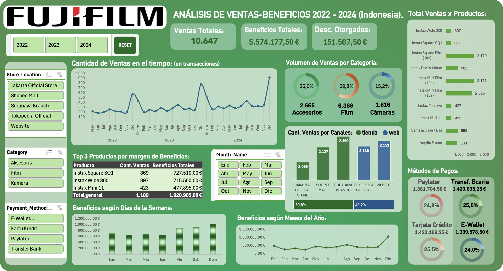

# 📊 Sales & Profit Analysis Dashboard (Excel)

Exploratory Data Analysis (EDA) and interactive dashboard built in Excel to analyze sales performance and profitability trends for Fujifilm Instax products in Indonesia.

## 📌 Project Overview

This project focuses on analyzing historical sales data (2022–2024) to uncover patterns, trends, and business insights. The final output is an interactive Excel dashboard designed to support data-driven decision-making.

## 🎯 Objectives

- Data cleaning and transformation  
- Descriptive data analysis  
- Interactive dashboard development  
- Insight communication through reporting  

## 🗂 Project Structure

### data/

└── instax_sales_transaction_data.csv

### dashboard/

└── dashboard-fujifilm.xlsm

└── dashboard-preview.png

└── complete-report.pdf

## Data Preparation

- Column names translated to English  
- Numerical values rescaled for readability  
- Data standardized and formatted (dates, numbers, text)  
- Removed incomplete records (year 2025)  
- Validated data quality (no nulls or duplicates)   
- Added unique identifier per record  

## 📊 Key Insights

- **Sales Trend:** Consistent year-over-year growth, peaking in 2024 (+21.47%)  
- **Seasonality:** December shows the highest sales peaks; February the lowest  
- **Top Products:**  
  - Most sold → Photo film  
  - Most profitable → Cameras  
- **Sales Channels:**  
  - Physical stores: 59.8%  
  - Online: 40.2%  
- **Customer Behavior:**  
  - Highest sales → Weekends (Friday to Sunday)  
  - Balanced distribution across payment methods  

## 💡 Business Insights

- Cameras generate the majority of profits despite lower sales volume 
- Online channel becomes more relevant in low-demand periods  
- Stable seasonal patterns across years  
- Revenue is highly concentrated on weekends
  
## 📈 Dashboard Preview

## 🛠️ Tools & Skills

- Microsoft Excel  
- Data Cleaning & Transformation  
- Exploratory Data Analysis (EDA)  
- Data Visualization  
- Business Analysis  

## ⏩ Future Improvements

- Analyze impact of discounts and promotions  
- Add advanced KPIs  
- Automate data updates  

## 👨‍💻 Author

**Rodrigo Antúnez**  
Economist | Data Analyst in training.
GitHub: https://github.com/rgoantunez
